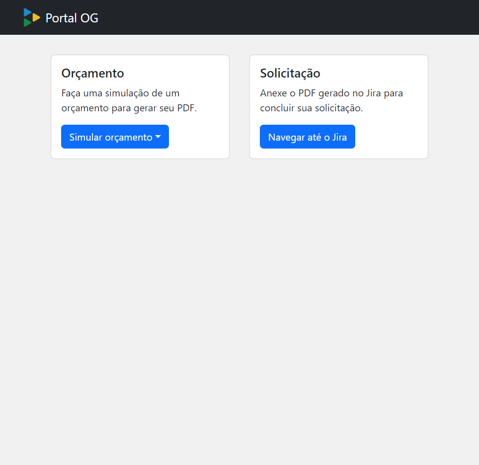

# Portal OG

O Portal OG foi uma demanda do meu estágio desenvolvida para a torre TIC, a aplicação é basicamente uma interface que visa agilizar as solicitações de criação de máquinas virtuais feita para os clientes que usam esse serviço.

Nele o cliente insere as configurações da máquina e no final é gerado um PDF usado para fazer a solicitação no Jira, o orçamento das VMs é feito através de uma API que consulta uma tabela excel com os preços.

